<div align="center">

<!-- ═══════════════════════════════ HEADER SVG ═══════════════════════════════ -->

<!-- ═══════════════════════════════════════════════════════════════════════════ -->

<!-- Profile Views Badge -->


</div>

---

<!-- Sneaking Robot Banner -->
<div align="center">
  
</div>

<!-- About Me Section -->


### 🧑‍💻 About Me

```yaml
Name       : Pratham Pravin Taikar
Role       : Full Stack Web Developer / SDE
Location   : Pune, India 📍
Languages  : English | Hindi | Marathi
Education  : B.Tech in IT @ VIT Pune (2024-2028)
Interests  : Web Dev | System Design | DSA
Contact    : prathamtaikar26@gmail.com
```

- 🔭 Currently exploring full-stack web development and scalable web applications.
- 🌱 Leveling up in **Next.js**, **TypeScript**, and backend architecture.
- 💡 Passionate about clean code, problem-solving, and sharing technical insights.
- 🏆 Active on **LeetCode** and **GeeksForGeeks**.
- 💬 Ask me about **Full Stack Dev**, **React**, **Node.js** & **C++**.
- ⚡ Fun fact: I debug with `console.log` and I'm proud of it 😄

<br clear="right"/>

---

<!-- Connect Section -->
##  Connect With Me

<div align="center">

[](https://www.linkedin.com/in/pratham-taikar/)
[](mailto:prathamtaikar26@gmail.com)
[](https://leetcode.com/u/frustratedOutcast/)
[](https://www.geeksforgeeks.org/profile/pratham15/)
[](https://github.com/Pratham-Taikar)

</div>

---

<!-- Skills Section -->
##  Tech Stack & Skills

### 🖥️ Languages
<div align="center">


</div>

### ⚛️ Frontend
<div align="center">


</div>

### 🔧 Backend
<div align="center">


</div>

### 🗄️ Databases
<div align="center">


</div>

### 🛠️ Tools & Platforms
<div align="center">


</div>

---

<!-- GitHub Stats -->
##  GitHub Stats

<div align="center">


</div>

<!-- Activity Graph -->
### 📈 Contribution Graph
<div align="center">

[](https://github.com/Pratham-Taikar)

</div>

<!-- Snake Animation -->
### 🐍 Contribution Snake
<div align="center">


</div>

---


<div align="center">

<!-- ═══════════════════════════════ FOOTER SVG ═══════════════════════════════ -->


</div>

